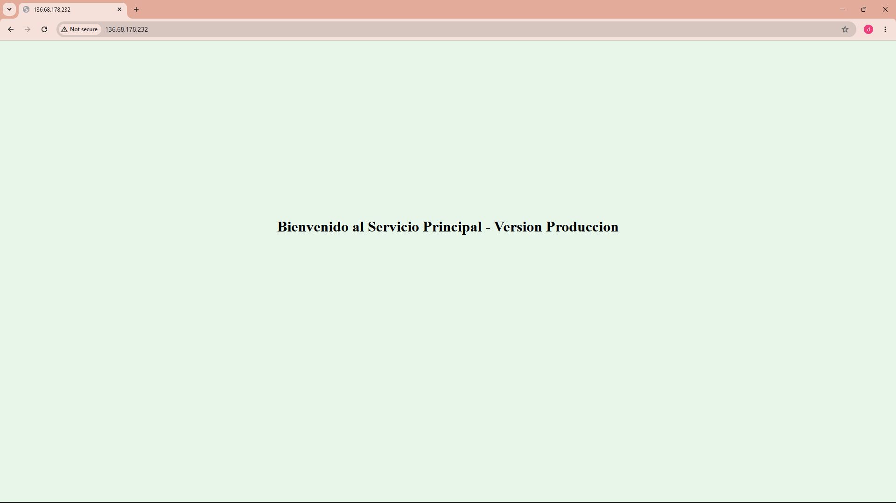
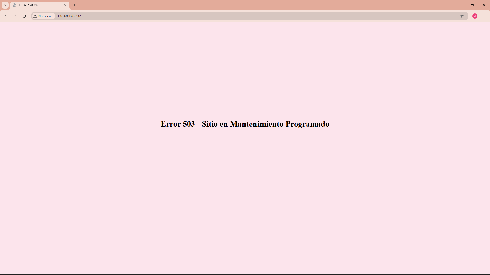
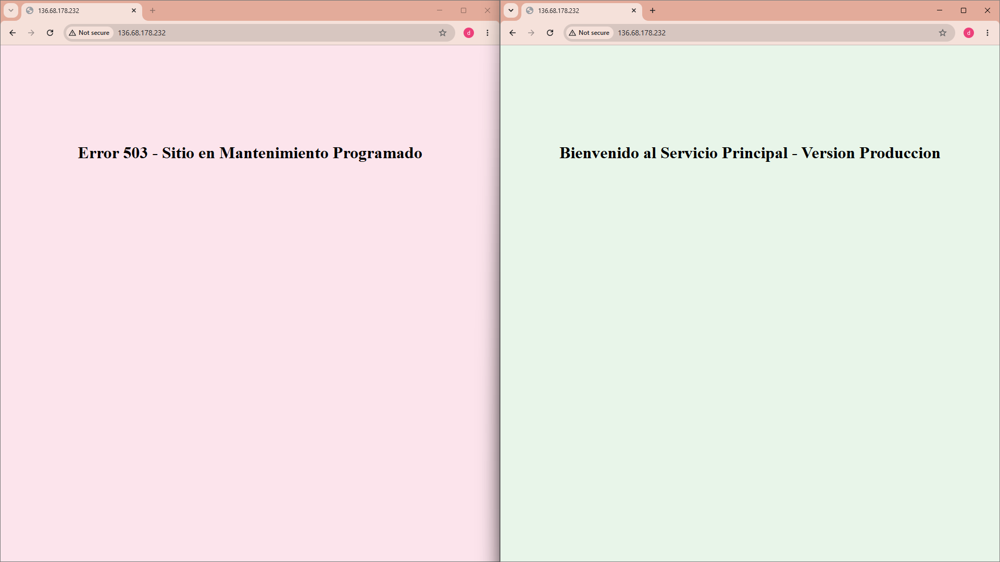

\# Proyecto Terraform - Control de Tráfico GCP

\*\*Servicios en la Nube 2026-01\*\*


\## Descripción

Infraestructura desplegada en Google Cloud Platform que implementa un balanceador de carga HTTP con división de tráfico ponderada entre dos servicios: un servicio principal de producción y un servicio de contingencia (mantenimiento).

## Evidencias

### Escenario 1 - Producción activa


### Escenario 2 - Mantenimiento total


### Escenario 3 - Balance equitativo


\## Arquitectura


```

Internet

&#x20;   │

&#x20;   ▼

\[IP Pública Única]

&#x20;   │

\[Global Forwarding Rule]

&#x20;   │

\[Target HTTP Proxy]

&#x20;   │

\[URL Map - Tráfico Ponderado]

&#x20;   ├── primary\_weight  → \[Backend Principal]  → \[VM Servicio Principal]

&#x20;   └── contingency\_weight → \[Backend Contingencia] → \[VM Servicio Contingencia]

```


\### Componentes

\- \*\*VPC personalizada\*\* con subred privada (10.0.1.0/24)

\- \*\*Cloud NAT\*\* para acceso a internet desde las VMs sin IP pública

\- \*\*2 VMs e2-micro\*\* con Debian 12 y nginx

\- \*\*2 Instance Groups\*\* (uno por VM)

\- \*\*Health Check HTTP\*\* en puerto 80

\- \*\*2 Backend Services\*\* con esquema EXTERNAL\_MANAGED

\- \*\*URL Map\*\* con weighted backend services

\- \*\*HTTP Load Balancer\*\* con IP pública única


\## Herramientas

\- Terraform >= 1.3

\- Google Cloud Platform

\- Provider: hashicorp/google \~> 5.0


\## Variables


| Variable | Descripción | Valor por defecto |

|---|---|---|

| `project\_id` | ID del proyecto GCP | - |

| `region` | Región de despliegue | us-central1 |

| `zone` | Zona de despliegue | us-central1-a |

| `primary\_weight` | Peso de tráfico al servicio principal (0-100) | 100 |

| `contingency\_weight` | Peso de tráfico al servicio de contingencia (0-100) | 0 |


\## Escenarios de Tráfico


| Escenario | primary\_weight | contingency\_weight | Resultado |

|---|---|---|---|

| Producción activa | 100 | 0 | Todo el tráfico al servicio principal |

| Mantenimiento total | 0 | 100 | Todo el tráfico al servicio de contingencia |

| Balance equitativo | 50 | 50 | Tráfico distribuido entre ambos servicios |


\## Uso


\### 1. Autenticarse con GCP

```bash

gcloud auth login

gcloud auth application-default login --scopes="https://www.googleapis.com/auth/cloud-platform"

```


\### 2. Configurar el proyecto

Editar `terraform.tfvars` con el ID del proyecto:

```hcl

project\_id = "tu-project-id"

```


\### 3. Desplegar

```bash

terraform init

terraform plan

terraform apply

```


\### 4. Cambiar escenario

Editar `terraform.tfvars` y aplicar:

```bash

terraform apply

```


\### 5. Destruir la infraestructura

```bash

terraform destroy

```


\## Outputs


\- `ip\_publica\_balanceador`: IP pública única de entrada al sistema

\- `escenario\_activo`: Muestra el porcentaje de tráfico activo por servicio


\## Páginas web desplegadas


\- \*\*Servicio Principal\*\*: "Bienvenido al Servicio Principal - Version Produccion" (fondo verde)

\- \*\*Servicio Contingencia\*\*: "Error 503 - Sitio en Mantenimiento Programado" (fondo rojo)

